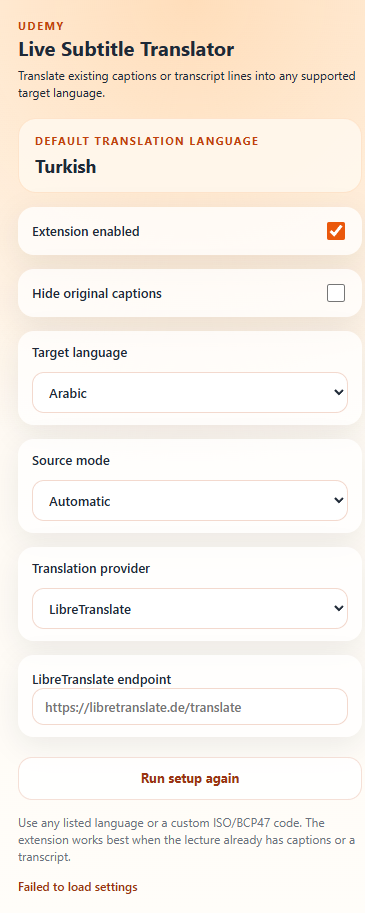

# 🎓 Udemy Live Subtitle Translator

<div align="center">


**Translate Udemy captions and transcripts into any language — instantly, on top of the video.**

[Features](#-features) · [Screenshots](#-screenshots) · [Install](#-install) · [How It Works](#-how-it-works) · [Providers](#-translation-providers) · [Privacy](#-privacy)

</div>

---

## ✨ Features

- 🌍 **Multi-language support** — pick from preset languages or enter any ISO/BCP47 code (e.g. `fi`, `cs`, `he`, `zh-HK`)
- 🧠 **Smart source detection** — reads from `video.textTracks`, native caption DOM, or the transcript panel
- 🖥️ **Fullscreen-ready** — transcript timeline cache keeps translations working after the panel disappears
- 👁️ **Hide original captions** — show only your translated overlay, no clutter
- ⚡ **Translation caching** — repeated lines are served instantly without a new request
- 🔌 **Two providers** — Google GTX (zero-config) or a self-hosted LibreTranslate endpoint
- 🎯 **First-run onboarding** — one-question setup to pick your default language
- 🛠️ **No build step** — plain JS, loads directly via `Load unpacked`

---

## 📸 Screenshots

<div align="center">

| First-Run Setup | Settings Panel | LibreTranslate Mode |
|:---:|:---:|:---:|
|  |  |  |

</div>

---

## 🚀 Install

### Developer Mode (manual)

1. Clone or download this repository
2. Open **`chrome://extensions`** in Chrome
3. Enable **Developer mode** (top-right toggle)
4. Click **Load unpacked**
5. Select the **`extension/`** folder inside this repo

> Chrome Web Store release coming soon.

---

## 🔧 How It Works

```
Udemy lecture page
       │
       ▼
 Content Script  (content.js)
   Detects active caption text
       │
       ▼
 Background Worker  (background.js)
   Translates via selected provider
   Caches repeated lines
       │
       ▼
 Overlay injected on top of the video
```

1. The content script watches for active caption text on the Udemy lecture page.
2. Each new line is sent to the background service worker.
3. The service worker translates the text and caches the result.
4. The translated subtitle is rendered as an overlay directly on top of the video.

---

## 🌐 Translation Providers

| Provider | Setup | Notes |
|---|---|---|
| **Google GTX** | None | Default. Zero-config, no API key needed. Not an official Google Cloud integration. |
| **LibreTranslate** | Endpoint URL | Self-hosted or public instance. Full privacy control. |

---

## 🎛️ Usage

1. Navigate to any Udemy lecture page
2. Click the extension icon in the toolbar
3. On first launch — answer **"What's your main language?"**
4. Enable captions on the video (if the course has them) or open the transcript panel
5. Keep **Extension enabled** toggled on
6. The translated subtitle overlay appears on top of the video

### Source Mode Options

| Mode | Description |
|---|---|
| **Automatic** | Tries all sources in order |
| **Text track** | Reads from `video.textTracks` API |
| **Native caption DOM** | Reads Udemy's caption element directly |
| **Transcript panel** | Reads the transcript sidebar |

---

## 📁 Repo Layout

```
udemy-live-subtitle-translator/
├── extension/
│   ├── manifest.json     ← Chrome extension manifest (MV3)
│   ├── background.js     ← Translation logic & response cache
│   ├── content.js        ← Caption detection & overlay rendering
│   ├── content.css       ← Subtitle overlay styles
│   ├── popup.html        ← Extension popup UI
│   ├── popup.js          ← Onboarding & settings logic
│   └── popup.css         ← Popup styles
├── screenshots/          ← UI screenshots for docs
├── .github/
│   └── workflows/
│       └── validate.yml  ← GitHub Actions syntax checks
├── CHANGELOG.md
├── CONTRIBUTING.md
├── LICENSE               ← MIT
├── PRIVACY.md
└── SECURITY.md
```

---

## ⚠️ Limitations

- Only works with courses that already have **captions or a transcript** panel
- Does **not** do live speech-to-text — no audio processing
- Translation quality depends on the selected provider and language pair
- Google GTX is not an official API; use LibreTranslate for production-grade reliability

---

## 🔒 Privacy

This extension may send caption/transcript text to the selected translation provider.

- **Google GTX** — text is sent to Google's servers
- **LibreTranslate** — text goes to your configured endpoint only

No browsing history, no personal data, and no Udemy credentials are ever collected.

Read [PRIVACY.md](./PRIVACY.md) for full details.

---

## 🤝 Contributing

Pull requests and issues are welcome! See [CONTRIBUTING.md](./CONTRIBUTING.md) for guidelines.

---

## 🛡️ Security

To report a security vulnerability, see [SECURITY.md](./SECURITY.md).

---

## 📋 Local Checks

```powershell
node --check extension\background.js
node --check extension\content.js
node --check extension\popup.js
```

---

## 📄 License

[MIT](./LICENSE) © 2026