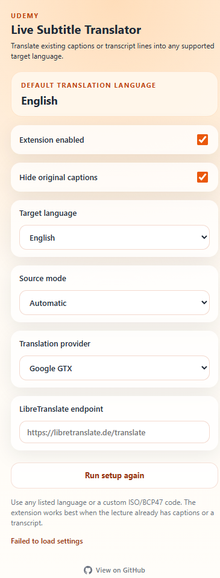

# 🎓 Udemy Live Subtitle Translator

<div align="center">


**Translate Udemy captions and transcripts into any language — live, on top of the video.**

[Features](#-features) · [Screenshots](#-screenshots) · [Install](#-install) · [How It Works](#-how-it-works) · [Providers](#-translation-providers) · [Privacy](#-privacy)

</div>

---

### 🌍 Available in your language

| | Language | README |
|---|---|---|
| 🇸🇦 | العربية | [docs/README.ar.md](docs/README.ar.md) |
| 🇩🇪 | Deutsch | [docs/README.de.md](docs/README.de.md) |
| 🇬🇷 | Ελληνικά | [docs/README.el.md](docs/README.el.md) |
| 🇺🇸 | English | **You are here** |
| 🇪🇸 | Español | [docs/README.es.md](docs/README.es.md) |
| 🇫🇷 | Français | [docs/README.fr.md](docs/README.fr.md) |
| 🇮🇳 | हिन्दी | [docs/README.hi.md](docs/README.hi.md) |
| 🇮🇩 | Bahasa Indonesia | [docs/README.id.md](docs/README.id.md) |
| 🇮🇹 | Italiano | [docs/README.it.md](docs/README.it.md) |
| 🇯🇵 | 日本語 | [docs/README.ja.md](docs/README.ja.md) |
| 🇰🇷 | 한국어 | [docs/README.ko.md](docs/README.ko.md) |
| 🇳🇱 | Nederlands | [docs/README.nl.md](docs/README.nl.md) |
| 🇵🇱 | Polski | [docs/README.pl.md](docs/README.pl.md) |
| 🇵🇹 | Português | [docs/README.pt.md](docs/README.pt.md) |
| 🇧🇷 | Português (BR) | [docs/README.pt-BR.md](docs/README.pt-BR.md) |
| 🇷🇴 | Română | [docs/README.ro.md](docs/README.ro.md) |
| 🇷🇺 | Русский | [docs/README.ru.md](docs/README.ru.md) |
| 🇸🇪 | Svenska | [docs/README.sv.md](docs/README.sv.md) |
| 🇹🇭 | ภาษาไทย | [docs/README.th.md](docs/README.th.md) |
| 🇹🇷 | Türkçe | [docs/README.tr.md](docs/README.tr.md) |
| 🇺🇦 | Українська | [docs/README.uk.md](docs/README.uk.md) |
| 🇻🇳 | Tiếng Việt | [docs/README.vi.md](docs/README.vi.md) |
| 🇨🇳 | 中文（简体） | [docs/README.zh-CN.md](docs/README.zh-CN.md) |
| 🇹🇼 | 中文（繁體） | [docs/README.zh-TW.md](docs/README.zh-TW.md) |

---

## ✨ Features

- 🌍 **Multi-language support** — pick from preset languages or enter any ISO/BCP47 code (e.g. `fi`, `cs`, `he`, `zh-HK`)
- 🧠 **Smart source detection** — reads from `video.textTracks`, native caption DOM, or the transcript panel
- 🖥️ **Fullscreen-ready** — transcript timeline cache keeps translations working after the panel disappears
- 👁️ **Hide original captions** — show only your translated overlay, no clutter
- ⚡ **Translation caching** — repeated lines are served instantly without a new request
- 🔌 **Two providers** — Google GTX (zero-config) or a self-hosted LibreTranslate endpoint
- 🎯 **First-run onboarding** — one-question setup to pick your default language
- 🛠️ **No build step** — plain JS, loads directly via `Load unpacked`

---

## 📸 Screenshots

<div align="center">

| First-Run Setup | Settings Panel |
|:---:|:---:|
|  |  |

</div>

---

## 🚀 Install

### Developer Mode (manual)

1. Clone or download this repository
2. Open **`chrome://extensions`** in Chrome
3. Enable **Developer mode** (top-right toggle)
4. Click **Load unpacked**
5. Select the **`extension/`** folder

> Chrome Web Store release coming soon.

---

## 🔧 How It Works

```
Udemy lecture page
       │
       ▼
 Content Script  (content.js)
   Detects active caption text
       │
       ▼
 Background Worker  (background.js)
   Translates via selected provider
   Caches repeated lines
       │
       ▼
 Overlay injected on top of the video
```

1. The content script watches for active caption text on the page.
2. Each new line is sent to the background service worker.
3. The service worker translates the text and caches the result.
4. The translated subtitle is rendered as an overlay on top of the video.

---

## 🌐 Translation Providers

| Provider | Setup | Notes |
|---|---|---|
| **Google GTX** | None | Default. Zero-config, no API key needed. |
| **LibreTranslate** | Endpoint URL | Self-hosted or public instance. Full privacy control. |

---

## 🎛️ Usage

1. Go to any Udemy lecture page
2. Click the extension icon
3. On first launch — pick your language
4. Enable captions on the video or open the transcript panel
5. Keep **Extension enabled** on
6. Translated subtitles appear on top of the video

### Source Mode Options

| Mode | Description |
|---|---|
| **Automatic** | Tries all sources in order |
| **Text track** | Reads from `video.textTracks` API |
| **Native caption DOM** | Reads Udemy's caption element directly |
| **Transcript panel** | Reads the transcript sidebar |

---

## 📁 Repo Layout

```
udemy-live-subtitle-translator/
├── extension/
│   ├── manifest.json
│   ├── background.js
│   ├── content.js
│   ├── content.css
│   ├── popup.html
│   ├── popup.js
│   └── popup.css
├── docs/                 ← Translated READMEs
├── screenshots/
├── .github/workflows/
├── CHANGELOG.md
├── CONTRIBUTING.md
├── LICENSE
├── PRIVACY.md
└── SECURITY.md
```

---

## ⚠️ Limitations

- Only works with courses that already have captions or a transcript panel
- Does not do live speech-to-text
- Translation quality depends on the provider and language pair

---

## 🔒 Privacy

This extension may send caption/transcript text to the selected translation provider. No browsing history, personal data, or Udemy credentials are ever collected.

Read [PRIVACY.md](./PRIVACY.md) for full details.

---

## 🤝 Contributing

Pull requests and issues are welcome. See [CONTRIBUTING.md](./CONTRIBUTING.md).

---

## 📄 License

[MIT](./LICENSE) © 2026