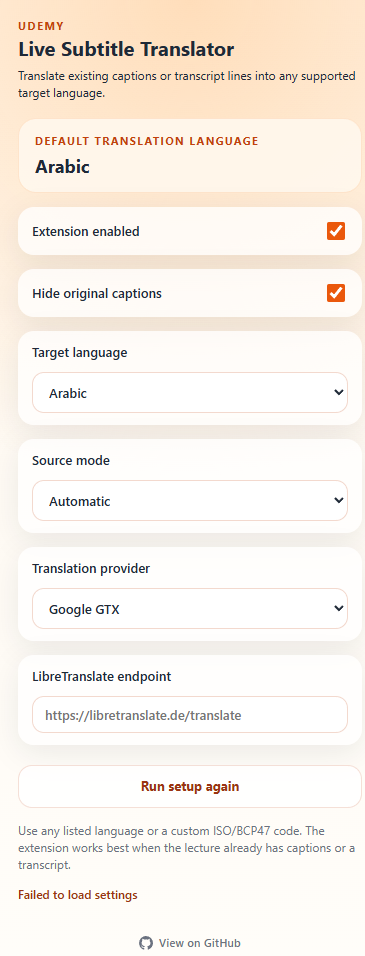

# 🎓 مترجم الترجمة المباشرة لـ Udemy

<div align="center">


**ترجم ترجمات Udemy ونصوص المحاضرات إلى أي لغة — مباشرةً فوق الفيديو.**

[← الصفحة الرئيسية](../README.md)

</div>

---

## 📸 لقطات الشاشة

<div align="center">

| الإعداد الأول | لوحة الإعدادات |
|:---:|:---:|
|  |  |

</div>

---

## ✨ المميزات

- 🌍 **دعم متعدد اللغات** — اختر من القائمة المُعدّة أو أدخل أي رمز ISO/BCP47 مخصص
- 🧠 **اكتشاف ذكي للمصدر** — يقرأ من `video.textTracks` أو DOM الترجمة أو لوحة النص
- 🖥️ **دعم الشاشة الكاملة** — تخزين مؤقت للنص يُبقي الترجمة تعمل بعد إغلاق اللوحة
- 👁️ **إخفاء الترجمة الأصلية** — اعرض الترجمة المخصصة فقط
- ⚡ **تخزين مؤقت للترجمة** — الأسطر المكررة تُقدَّم فوراً دون طلب جديد
- 🔌 **مزودان** — Google GTX (بدون إعداد) أو خادم LibreTranslate الخاص بك
- 🎯 **معالج الإعداد الأول** — سؤال واحد لتحديد لغتك الافتراضية
- 🛠️ **لا خطوة بناء** — JavaScript خالص، يُحمَّل مباشرةً

---

## 🚀 التثبيت

### وضع المطور (يدوي)

1. انسخ هذا المستودع أو نزّله كـ ZIP
2. افتح **`chrome://extensions`** في Chrome
3. فعّل **وضع المطور** (مفتاح التبديل في الزاوية العليا اليمنى)
4. انقر على **تحميل غير مضغوط**
5. اختر مجلد **`extension/`** داخل المستودع

> الإصدار على متجر Chrome قريباً.

---

## 🔧 كيف يعمل

```
صفحة محاضرة Udemy
       │
       ▼
 نص المحتوى  (content.js)
   يكتشف نص الترجمة النشط
       │
       ▼
 عامل الخلفية  (background.js)
   يترجم عبر المزود المحدد
   يخزن الأسطر المكررة مؤقتاً
       │
       ▼
 يُضاف كطبقة فوق الفيديو
```

1. يراقب نص المحتوى نص الترجمة النشط في الصفحة.
2. يُرسَل كل سطر جديد إلى عامل الخلفية.
3. يترجم العامل النص ويخزّن النتيجة.
4. تُعرَض الترجمة كطبقة مباشرةً فوق الفيديو.

---

## 🌐 مزودو الترجمة

| المزود | الإعداد | ملاحظات |
|---|---|---|
| **Google GTX** | لا شيء | الافتراضي. لا يحتاج مفتاح API. |
| **LibreTranslate** | رابط Endpoint | خادمك الخاص أو نسخة عامة. تحكم كامل بالخصوصية. |

---

## 🎛️ الاستخدام

1. انتقل إلى أي صفحة محاضرة على Udemy
2. انقر على أيقونة الإضافة في شريط الأدوات
3. عند الفتح الأول — اختر لغتك
4. فعّل الترجمة على الفيديو أو افتح لوحة النص
5. أبقِ **الإضافة مفعّلة**
6. تظهر الترجمات فوق الفيديو

---

## ⚠️ القيود

- يعمل فقط مع المحاضرات التي تحتوي على ترجمات أو نص
- لا يدعم التحويل المباشر من الكلام إلى نص
- جودة الترجمة تعتمد على المزود وزوج اللغات

---

## 🔒 الخصوصية

قد تُرسَل نصوص الترجمة إلى مزود الترجمة المحدد. لا يُجمَع أي سجل تصفح أو بيانات شخصية أو بيانات اعتماد Udemy.

اقرأ [PRIVACY.md](../PRIVACY.md) للتفاصيل الكاملة.

---

## 📄 الرخصة

[MIT](../LICENSE) © 2026