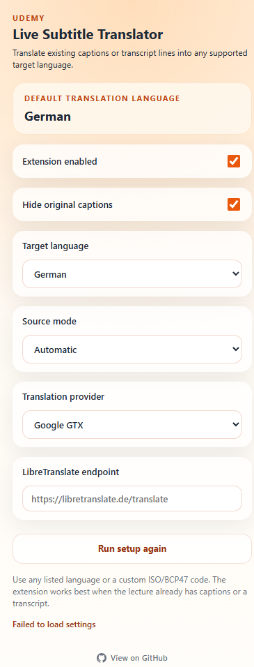

# 🎓 Udemy Live Untertitel-Übersetzer

<div align="center">


**Übersetze Udemy-Untertitel und Transkriptzeilen in jede Sprache — live, direkt über dem Video.**

[← Haupt-README](../README.md)

</div>

---

## 📸 Screenshots

<div align="center">

| Ersteinrichtung | Einstellungen |
|:---:|:---:|
|  |  |

</div>

---

## ✨ Funktionen

- 🌍 **Mehrsprachige Unterstützung** — aus voreingestellten Sprachen wählen oder eigenen ISO/BCP47-Code eingeben
- 🧠 **Intelligente Quellerkennung** — liest aus `video.textTracks`, nativem Untertitel-DOM oder dem Transkriptbereich
- 🖥️ **Vollbildmodus-bereit** — Transkript-Zwischenspeicher hält Übersetzungen aktiv, nachdem das Panel geschlossen wurde
- 👁️ **Originaluntertitel ausblenden** — nur die übersetzte Überlagerung anzeigen
- ⚡ **Übersetzungs-Cache** — Wiederholte Zeilen werden sofort ohne neue Anfrage geliefert
- 🔌 **Zwei Anbieter** — Google GTX (kein Setup) oder eigener LibreTranslate-Server
- 🎯 **Erststart-Assistent** — eine Frage zur Festlegung der Standardsprache
- 🛠️ **Kein Build-Schritt** — reines JS, direkt über `Load unpacked` ladbar

---

## 🚀 Installation

### Entwicklermodus (manuell)

1. Repository klonen oder als ZIP herunterladen
2. **`chrome://extensions`** in Chrome öffnen
3. **Entwicklermodus** oben rechts aktivieren
4. Auf **Entpackte Erweiterung laden** klicken
5. Den **`extension/`**-Ordner im Repository auswählen

> Chrome Web Store-Version kommt bald.

---

## 🔧 So funktioniert es

```
Udemy-Vorlesungsseite
       │
       ▼
 Inhaltsskript  (content.js)
   Erkennt aktiven Untertiteltext
       │
       ▼
 Hintergrund-Worker  (background.js)
   Übersetzt über gewählten Anbieter
   Speichert wiederholte Zeilen zwischen
       │
       ▼
 Überlagerung wird über dem Video eingefügt
```

1. Das Inhaltsskript überwacht aktiven Untertiteltext auf der Seite.
2. Jede neue Zeile wird an den Hintergrund-Service-Worker gesendet.
3. Der Worker übersetzt den Text und speichert das Ergebnis.
4. Der übersetzte Untertitel wird direkt über dem Video angezeigt.

---

## 🌐 Übersetzungsanbieter

| Anbieter | Einrichtung | Hinweise |
|---|---|---|
| **Google GTX** | Keine | Standard. Kein API-Schlüssel erforderlich. |
| **LibreTranslate** | Endpoint-URL | Eigener oder öffentlicher Server. Volle Datenschutzkontrolle. |

---

## 🎛️ Verwendung

1. Eine beliebige Udemy-Vorlesungsseite aufrufen
2. Auf das Erweiterungssymbol in der Symbolleiste klicken
3. Beim ersten Start — Sprache auswählen
4. Untertitel im Video aktivieren oder Transkriptbereich öffnen
5. **Erweiterung aktiviert** eingeschaltet lassen
6. Übersetzte Untertitel erscheinen über dem Video

---

## ⚠️ Einschränkungen

- Funktioniert nur mit Kursen, die bereits Untertitel oder ein Transkript haben
- Kein Live-Sprache-zu-Text
- Übersetzungsqualität hängt vom Anbieter und Sprachpaar ab

---

## 🔒 Datenschutz

Diese Erweiterung kann Untertitel-/Transkripttext an den gewählten Übersetzungsanbieter senden. Es werden keine Browserverläufe, persönliche Daten oder Udemy-Anmeldedaten erfasst.

Details in [PRIVACY.md](../PRIVACY.md).

---

## 📄 Lizenz

[MIT](../LICENSE) © 2026