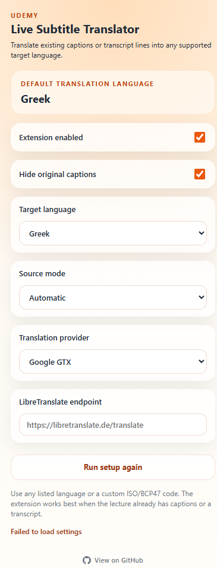

# 🎓 Μεταφραστής Ζωντανών Υποτίτλων Udemy

<div align="center">


**Μετάφραση υποτίτλων και μεταγραφής Udemy σε οποιαδήποτε γλώσσα — ζωντανά, πάνω από το βίντεο.**

[← Κύριο README](../README.md)

</div>

---

## 📸 Στιγμιότυπα

<div align="center">

| Πρώτη Εγκατάσταση | Πίνακας Ρυθμίσεων |
|:---:|:---:|
|  |  |

</div>

---

## ✨ Χαρακτηριστικά

- 🌍 **Πολυγλωσσική υποστήριξη** — επιλέξτε από προεπιλεγμένες γλώσσες ή εισάγετε προσαρμοσμένο κωδικό ISO/BCP47
- 🧠 **Έξυπνη ανίχνευση πηγής** — διαβάζει από `video.textTracks`, DOM υποτίτλων ή πίνακα μεταγραφής
- 🖥️ **Υποστήριξη πλήρους οθόνης** — η προσωρινή αποθήκευση κρατά τη μετάφραση ενεργή
- 👁️ **Απόκρυψη αρχικών υποτίτλων** — εμφάνιση μόνο της μεταφρασμένης επικάλυψης
- ⚡ **Προσωρινή αποθήκευση μεταφράσεων** — επαναλαμβανόμενες γραμμές εξυπηρετούνται άμεσα
- 🔌 **Δύο πάροχοι** — Google GTX (χωρίς ρύθμιση) ή δικός σας LibreTranslate
- 🎯 **Οδηγός πρώτης εκκίνησης** — μία ερώτηση για την προεπιλεγμένη γλώσσα
- 🛠️ **Χωρίς βήμα κατασκευής** — καθαρή JS, φορτώνεται απευθείας

---

## 🚀 Εγκατάσταση

### Λειτουργία Προγραμματιστή (χειροκίνητα)

1. Κλωνοποίηση ή λήψη του αποθετηρίου ως ZIP
2. Άνοιγμα **`chrome://extensions`** στο Chrome
3. Ενεργοποίηση **Λειτουργία προγραμματιστή** (πάνω δεξιά)
4. Κλικ στο **Φόρτωση αποσυσκευασμένης επέκτασης**
5. Επιλογή φακέλου **`extension/`**

> Έκδοση Chrome Web Store σύντομα.

---

## 🔧 Πώς λειτουργεί

```
Σελίδα μαθήματος Udemy
       │
       ▼
 Σενάριο Περιεχομένου  (content.js)
   Εντοπίζει ενεργό κείμενο υποτίτλου
       │
       ▼
 Εργαζόμενος Παρασκηνίου  (background.js)
   Μεταφράζει μέσω επιλεγμένου παρόχου
   Αποθηκεύει επαναλαμβανόμενες γραμμές
       │
       ▼
 Επικάλυψη πάνω από το βίντεο
```

---

## 🌐 Πάροχοι Μετάφρασης

| Πάροχος | Ρύθμιση | Σημειώσεις |
|---|---|---|
| **Google GTX** | Καμία | Προεπιλογή. Χωρίς κλειδί API. |
| **LibreTranslate** | URL Endpoint | Δικός σας ή δημόσιος. Πλήρης έλεγχος απορρήτου. |

---

## 🎛️ Χρήση

1. Μεταβείτε σε οποιαδήποτε σελίδα μαθήματος Udemy
2. Κάντε κλικ στο εικονίδιο επέκτασης
3. Κατά την πρώτη εκκίνηση — επιλέξτε γλώσσα
4. Ενεργοποιήστε υποτίτλους ή ανοίξτε πίνακα μεταγραφής
5. Κρατήστε **Επέκταση ενεργοποιημένη**
6. Οι μεταφρασμένοι υπότιτλοι εμφανίζονται πάνω στο βίντεο

---

## ⚠️ Περιορισμοί

- Λειτουργεί μόνο με μαθήματα που έχουν υποτίτλους ή μεταγραφή
- Δεν κάνει ζωντανή αναγνώριση ομιλίας
- Ποιότητα μετάφρασης εξαρτάται από τον πάροχο

---

## 🔒 Απόρρητο

Η επέκταση μπορεί να στείλει κείμενο υποτίτλου στον επιλεγμένο πάροχο. Δεν συλλέγεται ιστορικό περιήγησης, προσωπικά δεδομένα ή διαπιστευτήρια Udemy.

Δείτε [PRIVACY.md](../PRIVACY.md) για λεπτομέρειες.

---

## 📄 Άδεια

[MIT](../LICENSE) © 2026