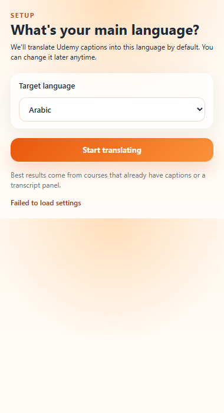
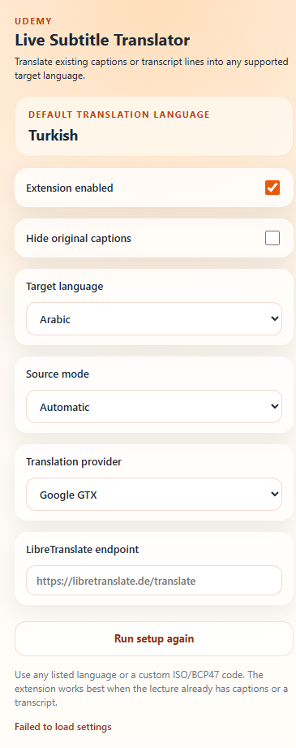

# 🎓 Tłumacz Napisów na Żywo dla Udemy

<div align="center">


**Tłumacz napisy i transkrypcje Udemy na dowolny język — na żywo, bezpośrednio na filmie.**

[← Główny README](../README.md)

</div>

---

## 📸 Zrzuty ekranu

<div align="center">

| Pierwsze uruchomienie | Panel ustawień |
|:---:|:---:|
|  |  |

</div>

---

## ✨ Funkcje

- 🌍 **Obsługa wielu języków** — wybierz z listy lub wpisz dowolny kod ISO/BCP47
- 🧠 **Inteligentne wykrywanie źródła** — odczytuje z `video.textTracks`, DOM napisów lub panelu transkrypcji
- 🖥️ **Gotowy na pełny ekran** — pamięć podręczna transkrypcji utrzymuje tłumaczenia aktywne
- 👁️ **Ukryj oryginalne napisy** — wyświetl tylko przetłumaczoną nakładkę
- ⚡ **Pamięć podręczna tłumaczeń** — powtarzające się linie dostarczane natychmiast
- 🔌 **Dwóch dostawców** — Google GTX (bez konfiguracji) lub własny serwer LibreTranslate
- 🎯 **Kreator pierwszego uruchomienia** — jedno pytanie do ustawienia domyślnego języka
- 🛠️ **Bez kroku budowania** — czysty JS, ładowany bezpośrednio

---

## 🚀 Instalacja

### Tryb dewelopera (ręcznie)

1. Sklonuj lub pobierz to repozytorium jako ZIP
2. Otwórz **`chrome://extensions`** w Chrome
3. Włącz **Tryb dewelopera** (prawy górny róg)
4. Kliknij **Załaduj rozpakowane**
5. Wybierz folder **`extension/`**

> Wersja Chrome Web Store wkrótce.

---

## 🔧 Jak to działa

```
Strona wykładu Udemy
       │
       ▼
 Skrypt zawartości  (content.js)
   Wykrywa aktywny tekst napisów
       │
       ▼
 Pracownik tła  (background.js)
   Tłumaczy przez wybranego dostawcę
   Przechowuje powtarzające się linie w pamięci
       │
       ▼
 Nakładka dodawana na film
```

---

## 🌐 Dostawcy tłumaczeń

| Dostawca | Konfiguracja | Uwagi |
|---|---|---|
| **Google GTX** | Brak | Domyślny. Nie wymaga klucza API. |
| **LibreTranslate** | URL punktu końcowego | Własny lub publiczny serwer. Pełna kontrola prywatności. |

---

## 🎛️ Użytkowanie

1. Przejdź do dowolnej strony wykładu Udemy
2. Kliknij ikonę rozszerzenia
3. Przy pierwszym uruchomieniu — wybierz język
4. Włącz napisy na filmie lub otwórz panel transkrypcji
5. Trzymaj **Rozszerzenie włączone**
6. Przetłumaczone napisy pojawią się na filmie

---

## ⚠️ Ograniczenia

- Działa tylko z kursami, które mają napisy lub transkrypcję
- Nie wykonuje konwersji mowy na tekst w czasie rzeczywistym
- Jakość tłumaczenia zależy od dostawcy i pary językowej

---

## 🔒 Prywatność

To rozszerzenie może wysyłać tekst napisów do wybranego dostawcy. Nie są zbierane historia przeglądania, dane osobowe ani dane logowania Udemy.

Przeczytaj [PRIVACY.md](../PRIVACY.md) po szczegóły.

---

## 📄 Licencja

[MIT](../LICENSE) © 2026