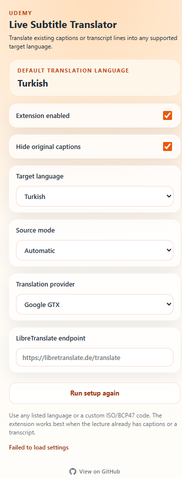

# 🎓 Udemy Canlı Altyazı Çevirmeni

<div align="center">


**Udemy altyazılarını ve transkript satırlarını istediğin dile çevir — video üzerinde, anında.**

[← Ana README](../README.md)

</div>

---

## 📸 Ekran Görüntüleri

<div align="center">

| İlk Kurulum | Ayarlar Paneli |
|:---:|:---:|
|  |  |

</div>

---

## ✨ Özellikler

- 🌍 **Çoklu dil desteği** — hazır listeden seç ya da özel ISO/BCP47 kodu gir (`fi`, `cs`, `he`, `zh-HK` gibi)
- 🧠 **Akıllı kaynak algılama** — `video.textTracks`, yerel altyazı DOM'u veya transkript panelinden okur
- 🖥️ **Tam ekran desteği** — transkript önbelleği panel kapandıktan sonra da çeviriyi sürdürür
- 👁️ **Orijinal altyazıyı gizle** — yalnızca çevrilmiş katmanı göster
- ⚡ **Çeviri önbelleği** — tekrar eden satırlar yeniden istek atılmadan anında sunulur
- 🔌 **İki sağlayıcı** — Google GTX (sıfır yapılandırma) veya kendi LibreTranslate sunucun
- 🎯 **İlk açılış sihirbazı** — tek soruda varsayılan dili belirle
- 🛠️ **Derleme adımı yok** — saf JS, `Load unpacked` ile direkt yüklenir

---

## 🚀 Kurulum

### Geliştirici Modu (manuel)

1. Bu repoyu klonla veya ZIP olarak indir
2. Chrome'da **`chrome://extensions`** adresini aç
3. Sağ üstteki **Geliştirici modu** geçişini aç
4. **Paketlenmemişi yükle**'ye tıkla
5. Repodaki **`extension/`** klasörünü seç

> Chrome Web Mağazası sürümü yakında.

---

## 🔧 Nasıl Çalışır

```
Udemy ders sayfası
       │
       ▼
 İçerik Betiği  (content.js)
   Aktif altyazı metnini algılar
       │
       ▼
 Arka Plan Çalışanı  (background.js)
   Seçili sağlayıcıyla çevirir
   Tekrar eden satırları önbelleğe alır
       │
       ▼
 Video üzerine katman olarak eklenir
```

1. İçerik betiği sayfadaki aktif altyazı metnini izler.
2. Her yeni satır arka plan servis çalışanına iletilir.
3. Servis çalışanı metni çevirir ve sonucu önbelleğe alır.
4. Çevrilmiş altyazı doğrudan video üzerinde katman olarak gösterilir.

---

## 🌐 Çeviri Sağlayıcıları

| Sağlayıcı | Kurulum | Notlar |
|---|---|---|
| **Google GTX** | Yok | Varsayılan. API anahtarı gerekmez. |
| **LibreTranslate** | Endpoint URL | Kendi sunucun veya genel bir örnek. Tam gizlilik kontrolü. |

---

## 🎛️ Kullanım

1. Herhangi bir Udemy ders sayfasına git
2. Araç çubuğundaki eklenti simgesine tıkla
3. İlk açılışta dilini seç
4. Videoda altyazıyı aç ya da transkript panelini aç
5. **Eklenti etkin** geçişini açık tut
6. Çevrilmiş altyazılar video üzerinde belirir

### Kaynak Modu Seçenekleri

| Mod | Açıklama |
|---|---|
| **Otomatik** | Tüm kaynakları sırayla dener |
| **Metin parçası** | `video.textTracks` API'sinden okur |
| **Yerel altyazı DOM** | Udemy'nin altyazı öğesini doğrudan okur |
| **Transkript paneli** | Transkript kenar çubuğunu okur |

---

## ⚠️ Sınırlamalar

- Yalnızca altyazısı veya transkripti olan kurslarla çalışır
- Canlı konuşma-metin dönüşümü yapmaz
- Çeviri kalitesi seçilen sağlayıcıya ve dil çiftine bağlıdır

---

## 🔒 Gizlilik

Bu eklenti, altyazı/transkript metnini seçilen çeviri sağlayıcısına gönderebilir. Tarama geçmişi, kişisel veri veya Udemy kimlik bilgisi hiçbir zaman toplanmaz.

Ayrıntılar için [PRIVACY.md](../PRIVACY.md) dosyasını oku.

---

## 📄 Lisans

[MIT](../LICENSE) © 2026